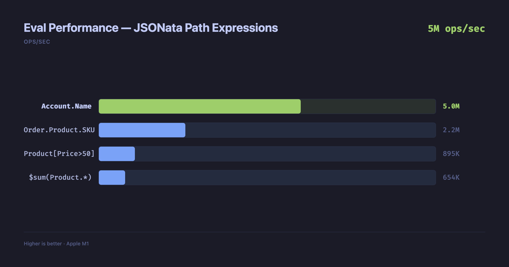
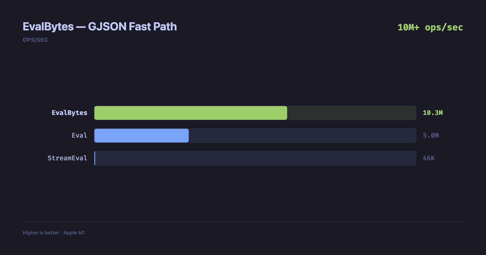

# gnata-sqlite

End-to-end [JSONata 2.x](https://jsonata.org) in Go — from a loadable SQLite extension to a composable React editor with context-aware autocomplete, everything needed to run, write, and edit JSONata expressions.

[](https://github.com/rbbydotdev/gnata-sqlite/actions/workflows/ci.yml)
[](https://pkg.go.dev/github.com/rbbydotdev/gnata-sqlite)
[](LICENSE)
[](https://go.dev)

## Highlights

- **Full JSONata 2.x spec** — paths, wildcards, lambdas, closures, higher-order functions, 50+ stdlib functions. 1,778 conformance tests, 0 failures
- **SQLite extension** — `jsonata()`, `jsonata_query()`, `jsonata_each()` as loadable functions with a built-in query planner that matches native SQL performance
- **React editor widget** — composable hooks and components (`@gnata-sqlite/react`) for embedding a JSONata editor in any app, with autocomplete, hover docs, and live diagnostics
- **85KB WASM LSP** — TinyGo-compiled language server powering in-browser editor features from the same Go codebase as the native LSP
- **Context-aware autocomplete** — the editor evaluates prefix expressions against live data to suggest nested keys, enabling end users to explore and write expressions without knowing the schema upfront
- **5M+ eval ops/sec** — two-tier evaluator with GJSON fast path hitting 10M+ ops/sec for simple paths

## Quick Start

```go
import "github.com/rbbydotdev/gnata-sqlite"

expr, _ := gnata.Compile(`Account.Order.Product.Price`)
result, _ := expr.Eval(context.Background(), data)
fmt.Println(result) // [34.45 21.67]
```

## SQLite Extension

```sql
.load ./gnata_jsonata sqlite3_jsonata_init

SELECT jsonata(data, 'Account.Name') FROM events;
-- "Firefly"

SELECT jsonata_query('$sum(amount)', data) FROM orders;
-- 4250
```

| Function | Description |
|----------|-------------|
| `jsonata(json, expr)` | Evaluate expression against JSON |
| `jsonata_query(expr, json)` | Expression-first argument order |
| `jsonata_each(expr, json)` | Expand results into rows (table-valued) |
| `jsonata_set(json, path, val)` | Set a value at a path |
| `jsonata_delete(json, path)` | Delete a value at a path |

See [sqlite/README.md](sqlite/README.md) for full docs. Query optimization details in [sqlite/OPTIMIZATION.md](sqlite/OPTIMIZATION.md).

## Benchmarks





<details>
<summary>Raw numbers (Apple M1)</summary>

| Benchmark | ops/sec | ns/op | allocs/op |
|-----------|---------|-------|-----------|
| Eval `Account.Name` | **5,037,783** | 198 | 4 |
| Eval `Order.Product.SKU` | 2,160,554 | 463 | 10 |
| Eval `Product[Price>50].SKU` | 895,255 | 1,117 | 26 |
| Eval `$sum(Product.*)` | 654,006 | 1,529 | 44 |
| EvalBytes `Account.Name` | **10,280,965** | 97 | 2 |
| Compile `Account.Name` | 1,757,469 | 569 | 13 |

</details>

## Packages

| Package | Description |
|---------|-------------|
| `gnata` (root) | Core JSONata 2.x engine — full spec, two-tier eval, streaming |
| [`sqlite/`](sqlite/README.md) | SQLite extension — loadable functions, query planner, mutations |
| [`editor/`](editor/README.md) | CodeMirror 6 language support + TinyGo WASM LSP |
| [`react/`](react/README.md) | Composable React widget — hooks, components, and full playground |

## Building

```bash
make all          # SQLite extension + WASM modules + CodeMirror package
make extension    # SQLite extension only (.dylib / .so)
make wasm         # WASM modules (gnata.wasm + gnata-lsp.wasm)
make test         # Go tests + React widget tests + playground tests
make playground   # Build WASM + start playground dev server
make website      # Start docs site dev server
```

See `Makefile` for all targets.

## Playground

Visit the [live playground](https://rbbydotdev.github.io/gnata-sqlite/) for interactive testing of JSONata expressions and the SQLite extension. To run locally:

```bash
cd playground && pnpm install && pnpm dev
```

## Contributing

See [CONTRIBUTING.md](CONTRIBUTING.md) for development setup and guidelines.

## Fork Notice

Forked from [RecoLabs/gnata](https://github.com/RecoLabs/gnata), which provides a production-grade JSONata 2.x engine in pure Go. This project extends the core engine with a SQLite extension, editor tooling, and query optimizer.

## License

[MIT](LICENSE)
