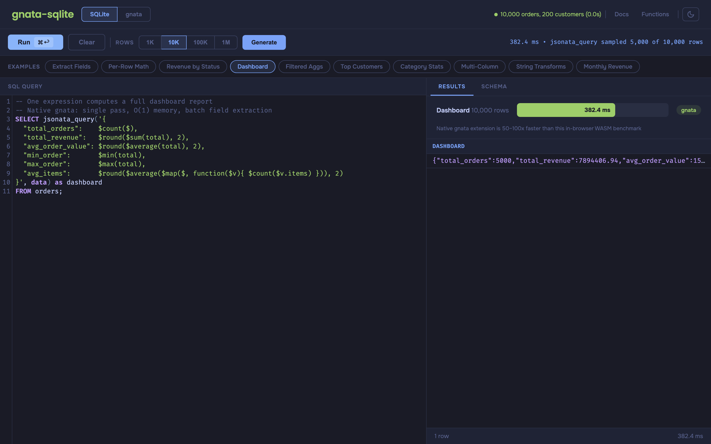
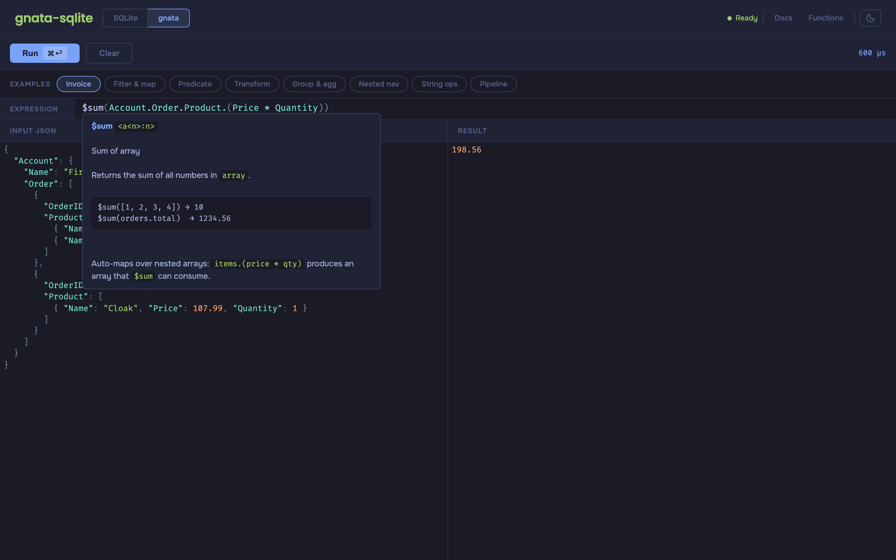
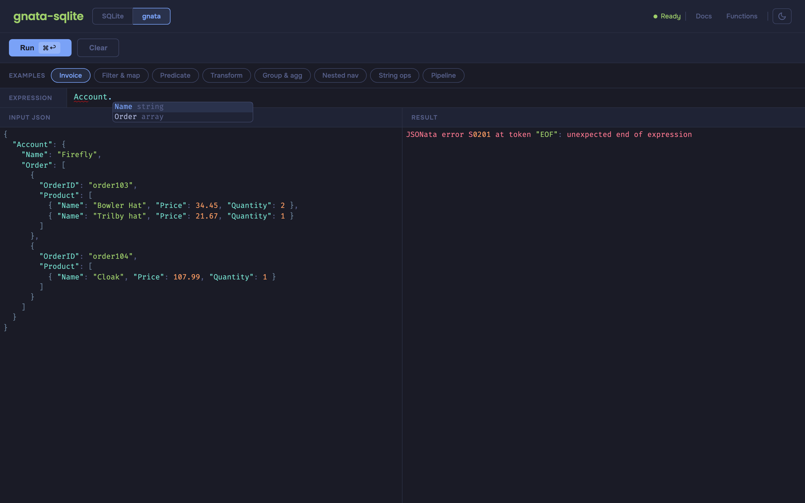
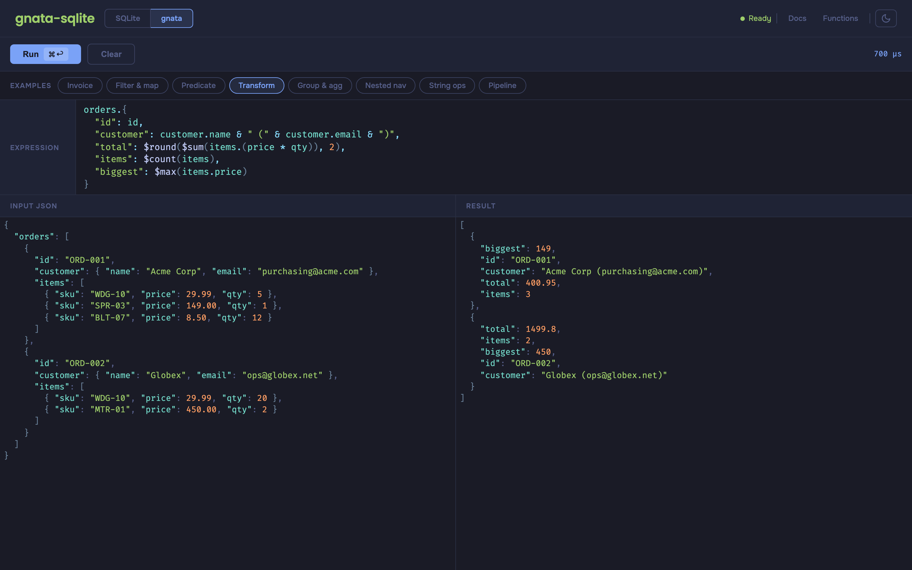

# gnata-sqlite

End-to-end [JSONata 2.x](https://jsonata.org) in Go — let end users write their own JSONata expressions against SQLite data, with a composable React editor that provides autocomplete, hover docs, and live diagnostics out of the box.

[](https://github.com/rbbydotdev/gnata-sqlite/actions/workflows/ci.yml)
[](https://pkg.go.dev/github.com/rbbydotdev/gnata-sqlite)
[](LICENSE)
[](https://go.dev)

**[Docs](https://rbby.dev/gnata-sqlite/)** · **[Playground](https://rbby.dev/gnata-sqlite/playground)** · **[Getting Started](https://rbby.dev/gnata-sqlite/docs/tutorials/getting-started)** · **[React Widget](https://rbby.dev/gnata-sqlite/docs/tutorials/react-widget)** · **[Architecture](https://rbby.dev/gnata-sqlite/docs/explanation/architecture)**

---

## The Problem

Applications store JSON in SQLite. Querying and transforming that data requires custom code for every new report, filter, or dashboard widget. End users can't explore the data themselves — they depend on developers to write each query.

## The Solution

gnata-sqlite makes SQLite JSON data queryable with [JSONata](https://jsonata.org) — a lightweight, expressive language end users can learn — and provides everything needed to embed an expression editor in any app:

1. **Load the SQLite extension** → JSON columns become queryable with JSONata
2. **Embed the React editor** → end users write expressions with autocomplete and live feedback
3. **Connect via schema** → the editor suggests fields from the actual database structure

No custom query builder UI. No hardcoded report logic. End users write expressions; the extension runs them.

## SQLite Extension

A loadable extension that brings JSONata into SQL queries. Install once, use from any SQLite client.



```sql
.load ./gnata_jsonata sqlite3_jsonata_init

-- Per-row: extract, transform, filter
SELECT jsonata('items[price > 100].name', data) FROM orders;

-- Aggregate: build a full report in one expression
SELECT jsonata_query('{
  "revenue":  $sum($filter($, function($v){ $v.status = "shipped" }).total),
  "orders":   $count($),
  "avg":      $round($average(total), 2)
}', data) FROM orders;
```

The query planner decomposes complex expressions into streaming accumulators — matching hand-tuned SQL performance on 100K+ rows. See [sqlite/OPTIMIZATION.md](sqlite/OPTIMIZATION.md).

| Function | Purpose |
|----------|---------|
| `jsonata(json, expr)` | Evaluate per row |
| `jsonata_query(expr, json)` | Aggregate across rows |
| `jsonata_each(expr, json)` | Expand results into rows |
| `jsonata_set(json, path, val)` | Set a value at a path |
| `jsonata_delete(json, path)` | Delete a value at a path |

## React Editor

A composable React package (`@gnata-sqlite/react`) for embedding a JSONata expression editor. Developers ship the editor; end users write expressions.

### Hover Documentation



Hover over any function to see its signature, description, and examples — powered by the 85KB TinyGo WASM LSP.

### Context-Aware Autocomplete



Type `Account.` and the editor evaluates the prefix expression against the input data to discover available keys — suggesting `Name`, `Order`, etc. with types.

### Expression Editor



Full JSONata syntax highlighting, live evaluation, and diagnostics (red underlines on errors).

### Quick Start

```tsx
import { useJsonataLsp, JsonataEditor } from '@gnata-sqlite/react'
import '@gnata-sqlite/react/tooltips.css'

function ExpressionBuilder() {
  const lsp = useJsonataLsp({
    lspWasmUrl: '/gnata-lsp.wasm',
    lspExecUrl: '/lsp-wasm_exec.js',
  })

  return (
    <JsonataEditor
      value={expression}
      onChange={setExpression}
      schema={schemaFromBackend}
      gnataDiagnostics={lsp.gnataDiagnostics}
      gnataCompletions={lsp.gnataCompletions}
      gnataHover={lsp.gnataHover}
    />
  )
}
```

**What end users get:** autocomplete, hover docs, live diagnostics, syntax highlighting

**What developers get:** 85KB WASM LSP, hooks-first API, no eval required, schema-driven

## How It Fits Together

The SQLite extension runs expressions on the backend. The React editor lets end users write those expressions in the browser. The schema protocol connects them.

```
Backend                          Frontend
┌──────────────────┐            ┌──────────────────────────┐
│ SQLite + gnata   │            │ @gnata-sqlite/react      │
│ extension        │  schema →  │ CodeMirror 6 editor      │
│                  │            │ + 85KB WASM LSP          │
│ Runs expressions │  ← expr   │ Autocomplete, hover,     │
│ against JSON data│            │ diagnostics              │
└──────────────────┘            └──────────────────────────┘
```

## Packages

| Package | Description |
|---------|-------------|
| `gnata` (root) | Core JSONata 2.x engine — 1,778 conformance tests, 0 failures |
| [`sqlite/`](sqlite/README.md) | Loadable SQLite extension with streaming query planner |
| [`editor/`](editor/README.md) | CodeMirror 6 language support + TinyGo WASM LSP |
| [`react/`](react/README.md) | Composable React hooks and components |
| [`playground/`](playground/) | Interactive playground (Vite + React) |
| [`website/`](website/) | Documentation site (Fumadocs) |

## Building

```bash
make all          # SQLite extension + WASM modules + CodeMirror package
make extension    # SQLite extension only (.dylib / .so)
make wasm         # WASM modules (gnata.wasm + gnata-lsp.wasm)
make test         # Go tests + React widget tests + playground tests
make playground   # Build WASM + start playground dev server
make website      # Start docs site dev server
```

## Playground

Visit the [live playground](https://rbby.dev/gnata-sqlite/playground) to try JSONata expressions against SQLite data in the browser. To run locally:

```bash
cd playground && pnpm install && pnpm dev
```

## Contributing

See [CONTRIBUTING.md](CONTRIBUTING.md) for development setup and guidelines.

## Fork Notice

Forked from [RecoLabs/gnata](https://github.com/RecoLabs/gnata), a JSONata 2.x engine in pure Go. This project extends it with a SQLite extension, query planner, TinyGo WASM LSP, CodeMirror editor, and composable React package.

## License

[MIT](LICENSE)
